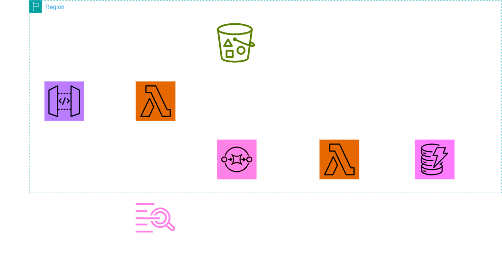

# AWS Cloud Formation Deployment for Subscriber Validation and Processing
This repository contains the Template and codes for deploying a serverless application that validates and processes subscriber data using API Gateway, Lamba Functions, SQS, S3 and DynamoDB. 

## Architecture Overview
1. API Gateway: Accepts incoming subscriber data via a POST request.
2. LambdaFunction1: 'validateSubscribers': Validates the schema ofincoming subscribers data
    * Valid Data: sent to SQS queue
    * Invalid Data: stored in s3 bucket for further processing
4. LambdaFunction2: ProcessValidSubscribers': Pool the SQS queue, checks for duplicate and insert new entries into DynamoDB


## Prerequisites
Ensure you have the following installed and configured:
* [AWS CLI](https://aws.amazon.com/cli/)
* [AWS Account](https://aws.amazon.com) "you need to have the necessary IAM permission to create and manage resources"

## Permissions to have
1. write logs to cloudwatch (for Lamda functions, it will help you debug)
2. put and read from SQS
3. put into s3 bucket (you could include an optional read from s3bucket if you want to append current file with newer information)
4. read and put into dynamoDB


## Deployment Instruction
#### Step 1: Upload the CloudFormation Template to S3
1. upload the 'template.yaml' file to S3 bucket
``` bas=
aws s3 cp template.yaml s3://InvalidSubscribers/
``` 
> Replace the bucket name *(InvalidSubscribers)* with yours

#### Step 2: Create the CloudFormation Stack
1. **Deploy the stack using the AWS CLI:**
``` bas=
aws cloudformation create-stack --stack-name [YourStackName] \
--template-url https://s3.amazonaws.com/InvalidSubscribers/template.yaml \
--capabilities CAPABILITY_IAM CAPABILITY_NAMED_IAM
```
> Dont forger to replace "[YourStackName]" with your desired stack name, and modify s3 template url if it has changed above. 

2. **Monitor the Stack using AWS CLI**
    * Monitoring the progress of the stack using AWS CLI 
```bas=
aws cloudformation describe-stacks --stack-name [YourStackName]
```
> Dont forget to replace "[YourStackName]" with actual

### Step 3: Retrieve Stack Outputs
After the stack is created, retrieve the outputs (API Gateway URL, SQS Queue URL, etc) using:

```bas=
aws cloudformation describe-stacks --stack-name [YourStackName] --query 'Stacks[0].Outputs
```
> Dont forget to replace "[YourStackName]" with actual

This will provide all the necessary information to interact with your deployed resources.

### Step 4: Testing the application
1. **Submit Subscriber Data:**
* Use an API Client like Postman or curl to submit data to the API gateway Endpoint. 
Example of Json Body:
```jsonld=
[
    {
    "Name": "Victor Oluwatobi",
    "Email": "uservictorOluwatobi@tobiakomoalfe.com",
    "opt-in": "yes",
    "Topicid": ["technology", "sci-fi", "IOT", "Health"]
    },
    {
    "Name": "Stephen Oluwatobi",
    "Email": "stephenuser@tobiakomolafe.com",
    "opt-in": "yes",
    "Topicid": ["technology", "sci-fi", "IOT", "Health"]
    },
    {
    "Name": "Victor Stephen",
    "Email": "victorstephen",
    "opt-in": "yes",
    "Topicid": ["technology", "sci-fi", "IOT", "Health"]
    },
    {
    "Name": "Chinedu Promise",
    "Email": "chineduPromise@sampleemail.com",
    "opt-in": "",
    "Topicid": ["Religion", "Business", "Cycling"]
    },
    {
    "Name": "Chinedu Promise",
    "Email": "chineduPromise@sampleemail.com",
    "opt-in": "no",
    "Topicid": ["Oryo", "Business", "Cycling"]
    }
]
```
>None of the email and data above is valid, and this is simply a sample data with delibrate informations end entry omitted, you can populate your own test data as you deem fit. 

2. ** Monitor Lambda Logs:
* View the logs of your lambda functions using AWS Cloudwatch to verify the data is processed correctly. 


### Step 5: Cleanup
To delete the stack and all associated resources, run the below command via cli
```bas=
aws cloudformation delete-stack --stack-name [YourStackName]
```
>this is expected to remove all the resources created by this stack. 


## License
This is licensed under MIT License. 
